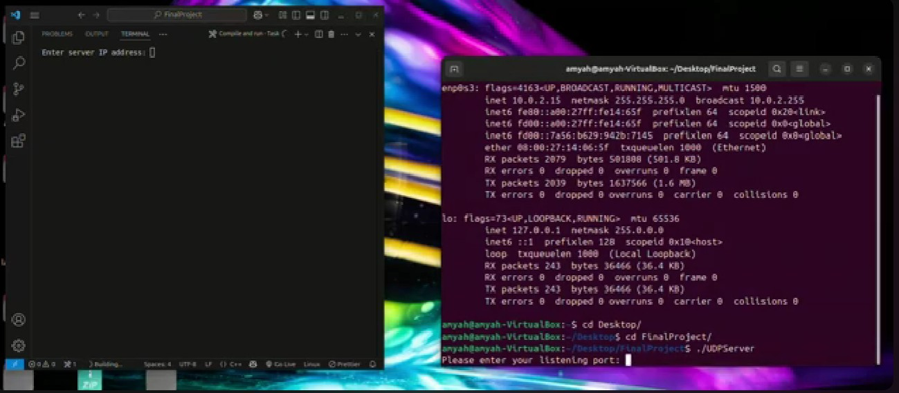

Portfolio
=========

Programming Projects
--------------------

*For access to my private project repositories, please [email me](mailto:atemple2@student.csuniv.edu?subject=GitHub%20Access) with the subject line, GitHub Access.

---
### [Webscraping| CSCI 301](project1)

---
### [Battleship| CSCI 235](project2)

---
### [UNO Game| CSCI 325](project3)

---
### [Air Drop | CSCI 332](project4)

---

Ethics Papers
-------------

### [ABET SLO 4 Ethics](/pdf/EthicsObject.pdf)

-   **Class:**  Object-Oriented Programming(325)
-   **Grade:** 100/100

### [AI Ethics Impact](/pdf/AIEthicsSSL.pdf)

-   **Class:** Survey of Scripting Lanuages(301)
-   **Grade:** 80/100

### [Ethics: Notifications and Distraction](/pdf/sample_presentation.pdf)

-   **Class:** Produceral Promgramming(235)
-   **Grade:** 92/100

---

Presentations
-------------

### [Air Drop](/pdf/AirDrop.pdf)

- **Class:** Appiled Networking
- **Grade:** 

### [UNO](/pdf/UnoJavaGame.pdf)

- **Class:** Object-Oriented Programming
- **Grade:**

---

Page template forked from <a href="https://github.com/csu-cs/csci-portfolio">CSU-CS</a>

<!-- Remove above link if you don't want to attributive -->
