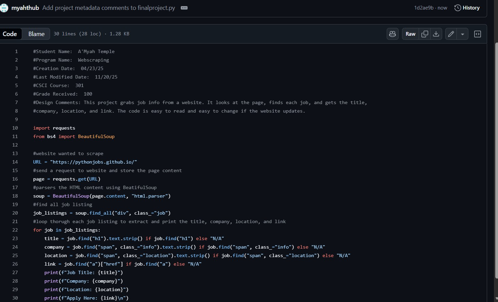
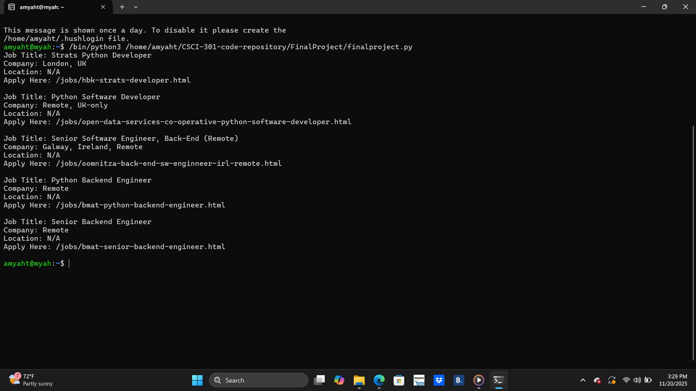

[Back to Portfolio](./)

Webscraping
===============

-   **Class:** Survey of Scripitng Languages
-   **Grade:** 100/100
-   **Language(s):** Python
-   **Source Code Repository:** [[features/mastering-markdown](https://guides.github.com/features/mastering-markdown/)](https://github.com/myahthub/CSCI-301-code-repository/tree/master/FinalProject)  
    (Please [email me](mailto:atemple2@student.csuniv.edu?subject=GitHub%20Access) to request access.)

## Project description

For this assignment, I used Python and Beautiful Soup to practice web scraping. The Real Python tutorial has a “Keep Practicing” exercise where I had to use my code on websites with static HTML. I picked one site and wrote a script to get a list of jobs that I’m interested in.

I used the requests library to get the webpage and Beautiful Soup to pull out the job titles. After collecting the jobs, I saved my Python file to GitHub and submitted the job list on Blackboard.
## How to compile and run the program

How to compile (if applicable) and run the project.

```bash
cd ./project
python scraper.py
```

If the programming language does not require compilation, the update the heading to be “How to run the program.” If your application is deployed on a remote service, including instructions on how to deploy it.

## UI Design

For this project, I used a command-line interface (CLI) instead of a normal visual interface. With a CLI, you type commands to control the computer instead of clicking buttons.

I used the command line to run my code, move around files, and run my Python web-scraping script. Even though it’s all text, it’s still a type of user interface because it lets me interact with the computer.

  
Fig 1. The launch screen

  
Fig 2. Example output after input is processed.


## 3. Additional Considerations

Using the command line has some things to watch out for. It can be tricky at first because you have to type commands instead of clicking buttons. Errors show up as plain text, so you need instructions to know what went wrong. Different computers use different commands, and the command line can do powerful things, so you have to be careful not to break anything.

For more details see [GitHub Flavored Markdown](https://guides.github.com/features/mastering-markdown/).

[Back to Portfolio](./)
