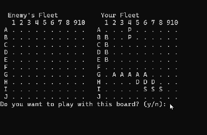
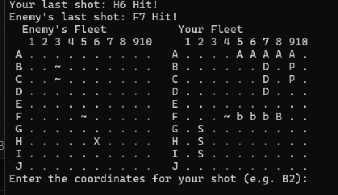
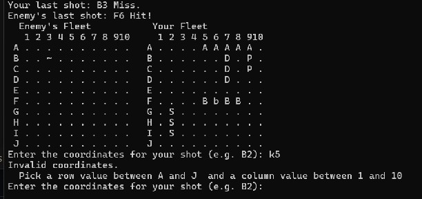

[Back to Portfolio](./)

Battleship
===============

-   **Class:** Produceral Programming
-   **Grade:** 105/100
-   **Language(s):** C++
-   **Source Code Repository:** [features/mastering-markdown](https://guides.github.com/features/mastering-markdown/)  
    (Please [email me](mailto:atemple2@student.csuniv.edu?subject=GitHub%20Access) to request access.)

## Project description

This C++ program is a text-based Battleship game where the player competes against the computer to sink each other’s ships. The game displays both the player’s and enemy’s boards, updates them after each turn, and allows the player to select a preferred randomly generated board layout. Players enter coordinates to take shots, with the program indicating hits, misses, and when a ship is sunk. The enemy uses an AI to take turns, including an animation effect to simulate decision-making. The game continues until all ships of one side are destroyed, at which point it announces the winner and shows the final board states.
## How to compile and run the program

How to compile (if applicable) and run the project.

```bash
g++ Battleship.cpp -o battleship.cpp

./battleship
```

## UI Design

The game features a text-based terminal interface that is clear and easy to navigate. Both the enemy’s and player’s boards are displayed side by side, with row labels (A-J) and column numbers (1-10) for coordinate reference. The enemy board shows only hits (X), misses (~), and unexplored water (.), 
while the player’s board displays all ships, hits, and misses. Players are prompted to select a preferred board layout at the start and to enter shot coordinates each turn, with invalid inputs handled gracefully. At the end of the game, both boards are displayed with all ships revealed, accompanied by a message announcing the winner.



Fig 1. The launch screen

  

Fig 2. Output after input is processed.


Fig 3. Invalid Coordinates


## 3. Additional Considerations

The game ensures valid input, preventing out-of-bounds or repeated shots, and updates the board clearly after each turn. Enemy AI uses brief animations to enhance gameplay, and ships are placed legally without overlapping. The program provides clear feedback for hits, misses, and sunk ships, keeping the game engaging and easy to follow.

For more details see [GitHub Flavored Markdown](https://guides.github.com/features/mastering-markdown/).

[Back to Portfolio](./)
