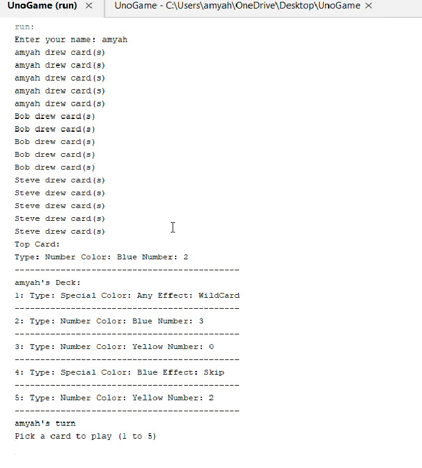

[Back to Portfolio](./)

UNO 
===============

-   **Class:** Objected-Orinented Programming
-   **Grade:** 70/100
-   **Language(s):** Java
-   **Source Code Repository:** [[features/mastering-markdown](https://guides.github.com/features/mastering-markdown/) ](https://github.com/csu-cs/UNOgame)
    (Please [email me](mailto:atemple2@student.csuniv.edu?subject=GitHub%20Access) to request access.)

## Project description
This project is a digital version of the classic UNO card game. The goal of the software is to allow a human player to play UNO against computer-controlled opponents (AI). 
The system manages the deck, turn order, card effects, and overall game flow. Players can draw cards, play valid cards, use action cards, and attempt to win by discarding all cards in their hand.

The game includes a user interface that displays the current turn, cards in each player’s hand, and the top card of the discard pile. The Game Manager controls the overall logic, 
such as enforcing rules, applying action card effects, switching turns, and determining when the game ends. AI opponents make simple strategic decisions on which card to play. 
The program follows an object-oriented design using several interacting classes, such as Player, AIPlayer, Card, Deck, ActionCard, GameUI, and GameManager.

## How to compile and run the program

How to compile (if applicable) and run the project.

```bash
cd ./project
python setup.py
```

If the programming language does not require compilation, the update the heading to be “How to run the program.” If your application is deployed on a remote service, including instructions on how to deploy it.

## UI Design

The UNO game uses a console-based interface to interact with the player. The main menu allows the player to start a new game, load a saved game, view instructions, or exit. During a new game, the player enters their name, selects the number of AI opponents, and chooses a difficulty level. Each turn, the console displays the player’s hand, the top card of the discard pile, and the current player. Players select a card to play or draw a card if no valid moves are available. Action cards prompt additional choices, such as selecting a color for Wild cards or notifying the next player to draw cards for Draw Two/Wild Draw Four cards. Players must declare “UNO” when they have one card left. The console validates inputs, shows error messages for invalid moves, and at the end of the game, displays the winner and final rankings, all through simple text prompts without a graphical interface.

  
Fig 1. The launch screen

  
Fig 2. Example output after input is processed.

  
Fig 3. Feedback when an error occurs.

## 3. Additional Considerations

The UNO game uses a console-based interface where players can start a new game, load a saved game, view instructions, or exit. Players enter their name, choose AI opponents, and select difficulty. Each turn, the console shows the player’s hand, the top discard card, and the current turn. Players can play a card or draw if no valid moves exist. Action cards prompt additional choices, such as selecting a color for Wild cards or forcing opponents to draw. Players must declare “UNO” when down to one card. The game provides clear feedback for invalid actions. Winners and rankings are displayed at the end, all through text prompts without a graphical interface.

For more details see [GitHub Flavored Markdown](https://guides.github.com/features/mastering-markdown/).

[Back to Portfolio](./)
