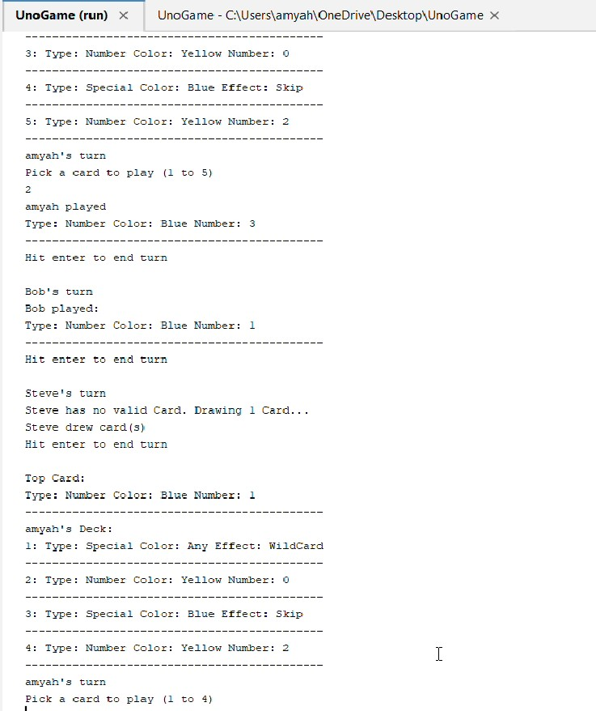

[Back to Portfolio](./)

UNO 
===============

-   **Class:** Objected-Orinented Programming
-   **Grade:** 70/100
-   **Language(s):** Java
-   **Source Code Repository:** [[features/mastering-markdown](https://guides.github.com/features/mastering-markdown/) ](https://github.com/myahthub/Uno.git)
    (Please [email me](mailto:atemple2@student.csuniv.edu?subject=GitHub%20Access) to request access.)

## Project description
This project is a digital version of the UNO card game where you play against computer opponents. The program keeps track of the cards, whose turn it is, and the rules of the game.

You can draw cards, play cards, and use special action cards to try to get rid of all your cards first. The game shows your cards, the top card on the pile, and whose turn it is. The computer players (AI) decide which card to play, and the program handles all the game logic using different classes like Player, AIPlayer, Card, Deck, and GameManager.
## How to compile and run the program

How to compile (if applicable) and run the project.

```bash
cd path/to/your/project
javac csu/csci325/*.java
```

## UI Design

The UNO game is played through the computer console. Players pick a card to play or draw a card if they can’t play, use special cards like Skip or Wild, say “UNO” when they have one card left, and the game tells them if they make a mistake and shows who wins at the end.


  
Fig 1. The launch screen

  
Fig 2. Game is in processed.

  
Fig 3. Game over

## 3. Additional Considerations

The UNO game is played in the console. Players enter their name, play against AI, and take turns playing cards or drawing if they can’t play. Special cards like Wild or Draw Two do extra things, and players say “UNO” when they have one card left. The game shows mistakes and tells who wins at the end. You can’t save or resume games.

For more details see [GitHub Flavored Markdown](https://guides.github.com/features/mastering-markdown/).

[Back to Portfolio](./)
