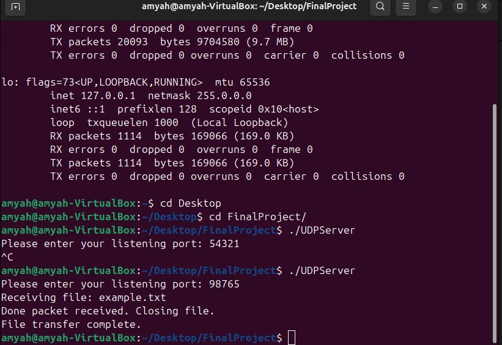
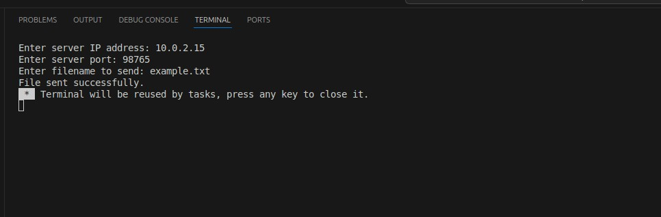

[Back to Portfolio](./)

Air Drop
===============

-   **Class:** Applied Networking
-   **Grade:** 100/100
-   **Language(s):** HTML, CSS, C++
-   **Source Code Repository:** [features/mastering-markdown](https://guides.github.com/features/mastering-markdown/)  
    (Please [email me](mailto:atemple2@student.csuniv.edu?subject=GitHub%20Access) to request access.)

## Project description
In this project, I build a UDP client and server in C++. The client reads a file in 1000-byte chunks, marks each packet as “Data” or “Done,” and sends it to the server. The server creates a new file, writes each packet it receives, and responds after each one until the final “Done” packet completes the transfer.

## How to compile and run the program

How to compile (if applicable) and run the project.

```bash
g++ server.cpp -o server
g++ client.cpp -o client

./server
./client
```

## UI Design
Focuses on creating clear, simple, and easy-to-use interfaces. My goal is to organize elements so users can navigate smoothly and complete tasks without confusion.

  
Fig 1. Server input

  
Fig 2. Client input


## 3. Additional Considerations

Ensuring the interface remains consistent, accessible, and responsive across different devices. I also make sure the layout supports user needs, loads efficiently, and maintains a clean, intuitive design throughout the project.

For more details see [GitHub Flavored Markdown](https://guides.github.com/features/mastering-markdown/).
